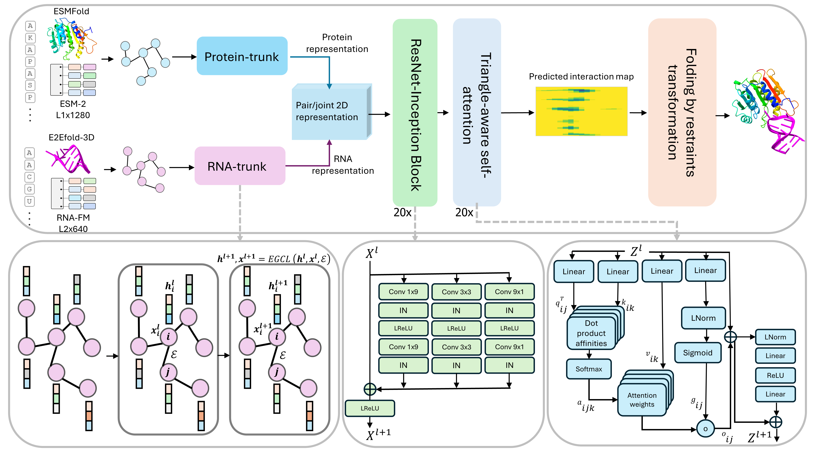

# ProRNA3D-single

## Single-sequence protein-RNA complex structure prediction by geometric triangle-aware pairing of language models

by Rahmatullah Roche, Sumit Tarafder, and Debswapna Bhattacharya

Codebase for our protein-RNA complex structure prediction method, ProRNA3D-single.



## Installation

1.) We recommend conda virtual environment to install dependencies for ProRNA3D-single. The following command will create a virtual environment named 'ProRNA3D-single'

`conda env create -f ProRNA3D-single_environment.yml`

2.) Then activate the virtual environment 

`conda activate ProRNA3D-single`

3.) The folding script requires [PyRosetta](https://www.pyrosetta.org/), which can be installed following [these instuctions](https://www.pyrosetta.org/downloads#h.iwt5ktel05jc).

4.) Download the trained model from [here](https://zenodo.org/records/11477127) and place inside `ProRNA3D_model/`

```
curl --output ProRNA3D_model/model.pt "https://zenodo.org/records/11477127/files/model.pt?download=1"
```

That's it! ProRNA3D-single is ready to be used.

## Usage

1.) Place the protein and RNA monomers (pdbs) inside `inputs/` 

2.) Place the [ESM2](https://github.com/facebookresearch/esm) embeddings inside `inputs/` (see example `inputs/7ZLQB.rep_1280.npy`), and place the [RNA-FM](https://github.com/ml4bio/RNA-FM) embeddings inside `inputs/` (see example here `inputs/7ZLQC_RNA.npy`).

3.) Place the protein (C<sub>α</sub>-C<sub>α</sub>) distance maps inside `prot_dist/` (see example `prot_dist/7ZLQB_prot.dist`), and place the RNA (C'<sub>4</sub>-C'<sub>4</sub>) distance maps inside `rna_dist/` (see example `rna_dist/7ZLQC_RNA.c4p.dist`).

4.) Put the list of targets in the file `inputs.list` inside `inputs/`.

5.) Run

```
python run_predictions.py
```

This script will run inference and generate inter-protein-RNA interactions inside `out_inter_rr/`. Then it will transform the predictions into folded 3D protein-RNA complex structures inside `predictions/`

## Datasets
- The train, validation, and test set lists are available inside `Datasets/`.
- Data curated from [PDB](https://www.rcsb.org).
