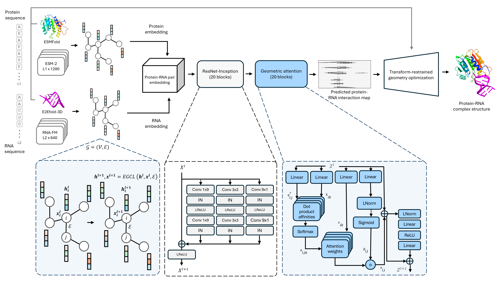

# ProRNA3D-single

## Single-sequence protein-RNA complex structure prediction by geometric triangle-aware pairing of language models

by Rahmatullah Roche, Sumit Tarafder, Bernard Moussad, and Debswapna Bhattacharya

Codebase for our protein-RNA complex structure prediction method, ProRNA3D-single.

## Installation

1.) We recommend conda virtual environment to install dependencies for ProRNA3D-single. The following command will create a virtual environment named 'ProRNA3D-single'

`conda env create -f ProRNA3D-single_environment.yml`

2.) Then activate the virtual environment 

`conda activate ProRNA3D-single`

3.) Download model from [here](https://zenodo.org/records/11477127), extract and place inside `ProRNA3D_model/`

That's it! ProRNA3D-single is ready to be used.

## Usage
